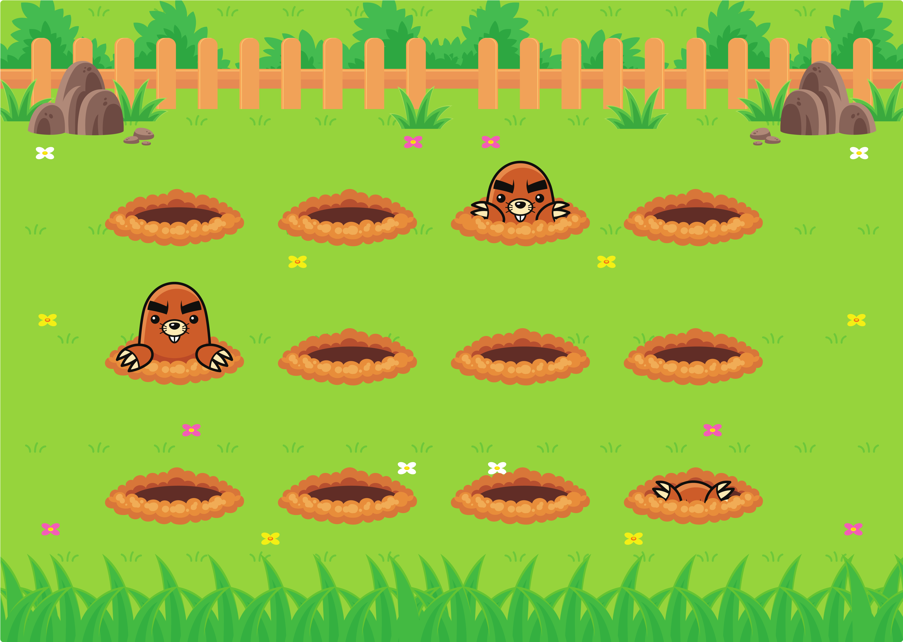

<div align="center">
  
  <h2 align="center">Jardim das toupeiras</h2>

</div>

<br/>

### Demo Screeshots



### About

Project developed during stage 3 - Moving forward in HTML and CSS, in [Rocketseat](https://github.com/Rocketseat) explorer course.  

The idea of this project is to put into practice everything that was seen in the third phase of the explorer and make the moles get excited.

Scenery was set up with animations with CSS keyframes to make the moles appear in the field.

### Prerequisites

Before you begin, ensure you have met the following requirements:

- [Git](https://git-scm.com/downloads "Download Git") must be installed on your operating system.

### Run Locally

To run **Jardim das toupeiras** locally, run this command on your git bash:

Linux and macOS:

```bash
sudo git clone https://github.com/denilsonbaptista/jardim-das-toupeiras.git
```

Windows:

```bash
git clone https://github.com/denilsonbaptista/jardim-das-toupeiras.git
```

### Contact

If you want to contact with me you can reach me at [Linkedin](https://www.linkedin.com/in/denilsonbaptista/).

### License

This project is **free to use** and does not contains any license.